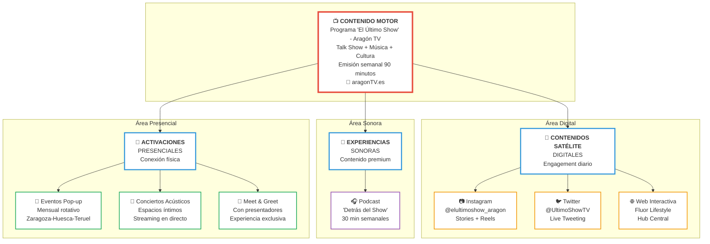

```mermaid
%% === ECOSISTEMA DE CONTENIDOS 'EL ÚLTIMO SHOW' ===
%% Diagrama optimizado para claridad y mantenimiento
graph TD
    subgraph " "
        A["📺 <b>CONTENIDO MOTOR</b><br/>Programa 'El Último Show' - Aragón TV<br/>Talk Show + Música + Cultura<br/>Emisión semanal 90 minutos<br/>🔗 aragonTV.es"]
    end

    %% --- Ramas de Contenido ---
    A --> B["📱 <b>CONTENIDOS SATÉLITE</b><br/>DIGITALES<br/>Engagement diario"]
    A --> C["🎵 <b>EXPERIENCIAS</b><br/>SONORAS<br/>Contenido premium"] 
    A --> D["🎪 <b>ACTIVACIONES</b><br/>PRESENCIALES<br/>Conexión física"]

    %% --- Subgrafos por Área ---
    subgraph "Área Digital"
        B --> E["📷 Instagram<br/>@elultimoshow_aragon<br/>Stories + Reels"]
        B --> F["🐦 Twitter<br/>@UltimoShowTV<br/>Live Tweeting"]
        B --> G["🌐 Web Interactiva<br/>Fluor Lifestyle<br/>Hub Central"]
    end
    
    subgraph "Área Sonora"
        C --> H["🎧 Podcast<br/>'Detrás del Show'<br/>30 min semanales"]
    end

    subgraph "Área Presencial"
        D --> I["🎉 Eventos Pop-up<br/>Mensual rotativo<br/>Zaragoza-Huesca-Teruel"]
        D --> J["🎵 Conciertos Acústicos<br/>Espacios íntimos<br/>Streaming en directo"]
        D --> K["🤝 Meet & Greet<br/>Con presentadores<br/>Experiencia exclusiva"]
    end

    %% === Enlaces Clickables ===
    click A "https://aragonTV.es" "Página oficial Aragón TV"
    click E "https://instagram.com/elultimoshow" "Instagram oficial"
    click F "https://twitter.com/ultimoshowtv" "Twitter oficial"
    click G "https://fluorlifestyle.com/ultimo-show" "Web principal"
    click H "https://spotify.com/detrasdelshow" "Podcast en Spotify"

    %% === Estilos Simplificados ===
    %% Se ha eliminado la clase 'blanco' y se ha integrado su estilo en las demás
    classDef motor fill:#fff,stroke:#E74C3C,stroke-width:4px,color:#333
    classDef categoria fill:#fff,stroke:#3498DB,stroke-width:3px,color:#333
    classDef digital fill:#fff,stroke:#F39C12,stroke-width:2px,color:#333
    classDef sonoro fill:#fff,stroke:#9B59B6,stroke-width:2px,color:#333
    classDef presencial fill:#fff,stroke:#27AE60,stroke-width:2px,color:#333

    %% === Asignación de Estilos ===
    class A motor
    class B,C,D categoria
    class E,F,G digital
    class H sonoro
    class I,J,K presencial
```
